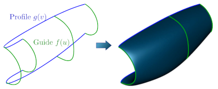

# occ_gordon: A Curve Network Interpolation Library for OpenCASCADE (OCCT)

__occ_gordon__ is a lightweight C++ and Python library that implements __curve network interpolation__ using B-spline surfaces within the __OpenCASCADE (OCCT)__ framework.

OCCT lacks built-in support for __Gordon surface interpolation__, which is a method for interpolating arbitrary large curve networks. This library was developed to provide that functionality and help create smooth, accurate surfaces from interconnected curves in OCCT.

## What is a Curve Network?

A curve network is a collection of interconnected curves that define the structural framework or "skeleton" of a surface or shape. By interpolating a curve network, complex surfaces can be created accurately.



## Key Features ⭐

- ✨ __Gordon Surface Interpolation__: Implements the Gordon surface interpolation method, a generalization of the Coons patch, for smooth B-spline surfaces from profile and guide curves.
- 🔧 __Curve Network Reparametrization__: Reparametrizes the curve network if needed to improve interpolation robustness.
- 📦 __Single Header Distribution__: A generated standalone header is available for packaging and release workflows.
- 🤝 __OpenCASCADE Integration__: Fully integrated with OpenCASCADE for OCCT-based projects.
- 🐍 __Python Support__: Python bindings are available for use with __pythonocc__.
- 🚀 __Lightweight__: Based on a streamlined version of the [TiGL library](https://github.com/DLR-SC/tigl), focused on curve network interpolation using B-splines and no additional runtime dependencies besides OCCT.
- 🔒 __Open Source and Apache Licensed__: Released under the permissive Apache 2.0 license.

## About the Gordon Surface Method

The __Gordon surface interpolation__ method was first published by W.J. Gordon in 1969. It enables surface generation from an arbitrary number of guide and profile curves using B-splines. It extends the __Coons patch__ method to more complex curve networks.

## Usage Example (C++)

For the normal library build, include the standard header:

```cpp
#include <occ_gordon/occ_gordon.h>
```

The main function for curve network interpolation is `occ_gordon::interpolate_curve_network`.

```cpp
#include <occ_gordon/occ_gordon.h>

std::vector<Handle(Geom_Curve)> vcurves, ucurves;

// Create the curve network
...

double inters_tol = 1e-4; // distance, in which the curves need to intersect

auto surface = occ_gordon::interpolate_curve_network(ucurves, vcurves, inters_tol);
```

## Single Header Distribution

If you want a single-header deployment, download the generated `occ_gordon_single.hpp` artifact from the GitHub Actions build workflow or from a published release asset.

Use it like this:

```cpp
#define OCC_GORDON_IMPLEMENTATION
#include <occ_gordon_single.hpp>
```

This form is intended for packaging and redistribution. The generated header does not need to be committed to the repository.

If you need to generate the header locally, enable the optional CMake switch described in the build section below.

## Use from Python

To install occ_gordon from Python, install it via conda/mamba from conda-forge:

```sh
conda install occ-gordon -c conda-forge
```

To use it, pass two curve arrays to the function:

```python
from occ_gordon import interpolate_curve_network

...
surface = interpolate_curve_network(profile_curves, guide_curves, tolerance=1.e-5)
```

## Building

To build occ_gordon, you need a recent version of __CMake__ (3.15 or higher) and a working installation of __OpenCASCADE__.

```sh
cmake -S . -B build -DOpenCASCADE_DIR=<path/to/cmake/opencascade> -DCMAKE_INSTALL_PREFIX=<path/to/install>
cmake --build build
cmake --build build --target install
```

To build the optional single-header release artifact as part of the build, add:

```sh
cmake -S . -B build -DOpenCASCADE_DIR=<path/to/cmake/opencascade> -DCMAKE_INSTALL_PREFIX=<path/to/install> -DOCC_GORDON_BUILD_SINGLE_HEADER=ON
```

That keeps the normal library build unchanged and only enables Python when you explicitly request the generated header.

## License

occ_gordon is licensed under the __Apache 2.0 License__, making it free to use, modify, and distribute in personal and commercial projects.

## Citing

This algorithm was originally developed as part of the __TiGL library__.
If you use the occ_gordon library in your work, please cite the following paper:

[Siggel M. et. al. (2019), _TiGL: An Open Source Computational Geometry Library for Parametric Aircraft Design_](https://doi.org/10.1007/s11786-019-00401-y)

```bibtex
@article{siggel2019tigl,
	title={TiGL: an open source computational geometry library for parametric aircraft design},
	author={Siggel, Martin and Kleinert, Jan and Stollenwerk, Tobias and Maierl, Reinhold},
	journal={Mathematics in Computer Science},
	volume={13},
	number={3},
	pages={367--389},
	year={2019},
	publisher={Springer},
    doi={10.1007/s11786-019-00401-y}
}
```
